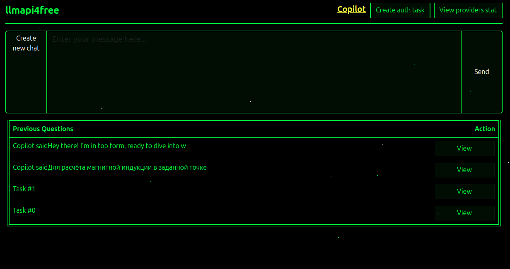
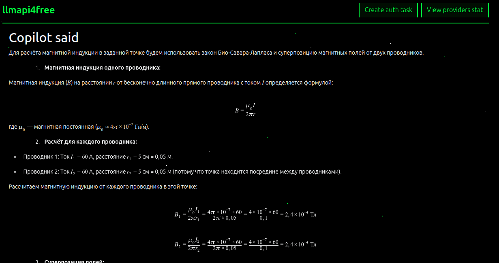
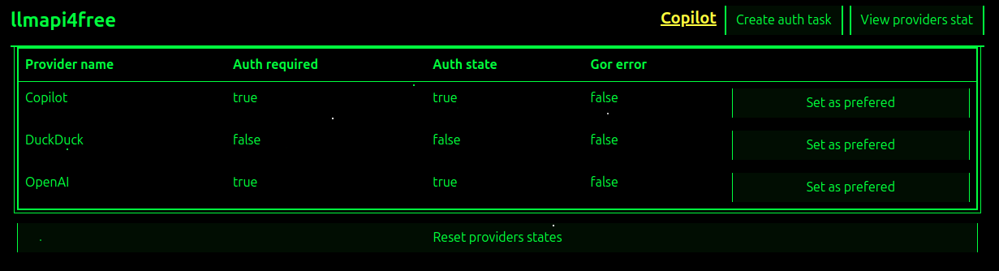

# LLMapi4free

Унифицированный API для доступа к различным языковым моделям (LLM) через автоматизацию браузера. Получите бесплатный доступ к OpenAI, DeepSeek, DuckDuckGo, Gemini и другим провайдерам через единый интерфейс.

[Демонстрация работы (старая версия)](https://youtu.be/lHJaL333qAE)

## 📑 Оглавление

- [🚀 Установка](#-установка)
- [🔨 Сборка из исходного кода](#-сборка-из-исходного-кода)
- [⚡ Быстрый старт](#-быстрый-старт)
- [🌐 Веб-интерфейс](#-веб-интерфейс)
- [🐍 Пример использования](#-пример-использования)
- [📚 API Документация](#-api-документация)
  - [Аутентификация](#аутентификация)
  - [Управление чатом](#управление-чатом)
  - [Управление провайдерами](#управление-провайдерами)
  - [Системные endpoints](#системные-endpoints)
- [⚙️ Дополнительные настройки](#️-дополнительные-настройки)
  - [Поддержка прокси](#поддержка-прокси)
  - [Развертывание на сервере](#развертывание-на-сервере)

## 🚀 Установка

### Linux

1. Установите OpenJDK 21+:
   ```bash
   sudo apt install openjdk-21-jdk
   ```

2. Установите необходимые зависимости (только для Linux):
   ```bash
   sudo apt install xdotool
   ```

3. Установите браузер Chrome

4. Скачайте и запустите .jar файл из раздела [Releases](../../releases):
   ```bash
   java -jar bingchat4urapp_server-0.0.1-SNAPSHOT.jar
   ```

5. Сервер запустится на порту 8080

## 🔨 Сборка из исходного кода

Если вы хотите собрать проект самостоятельно из исходного кода:

### Предварительные требования

1. Установите OpenJDK 21+:
   ```bash
   sudo apt install openjdk-21-jdk
   ```

2. Установите Apache Maven:
   ```bash
   sudo apt install maven
   ```

3. Установите необходимые зависимости (только для Linux):
   ```bash
   sudo apt install xdotool
   ```

4. Установите браузер Chrome

> 💡 **Примечание для Windows:** На Windows не требуется установка дополнительных утилит, достаточно Java и Maven.

### Процесс сборки

1. **Сборка и установка библиотеки:**
   ```bash
   cd llmapi4free_lib
   ./install.sh
   ```
   
   Этот скрипт соберет библиотеку llmapi4free и установит её в локальный Maven-репозиторий.

2. **Сборка веб-приложения:**
   ```bash
   cd serverimpl/bingchat4urapp_server
   ./build.sh
   ```
   
   Этот скрипт соберет веб-приложение с REST API, которое позволяет использовать библиотеку через веб-интерфейс или REST API.

3. **Запуск собранного приложения:**
   ```bash
   java -jar target/bingchat4urapp_server-0.0.1-SNAPSHOT.jar
   ```

> 💡 **Примечание:** Первый скрипт (install.sh) собирает и устанавливает библиотеку в локальный Maven-репозиторий, а второй скрипт (build.sh) собирает веб-приложение, которое использует эту библиотеку.

## ⚡ Быстрый старт

1. **Запустите сервер** - откроется окно браузера
2. **Войдите в Google аккаунт** в открывшемся окне браузера
3. **Готово!** Теперь можете использовать API или веб-интерфейс

> 💡 **Важно:** Авторизация в Google обязательна для всех LLM провайдеров. Выполните её один раз при запуске сервера.

## 🌐 Веб-интерфейс

Откройте в браузере: `http://127.0.0.1:8080/`

Веб-интерфейс позволяет:
- Тестировать работу сервиса
- Управлять провайдерами
- Просматривать историю ответов





## 🐍 Пример использования

В файле [`example/example.py`](example/example.py) находится готовый Python-клиент, демонстрирующий работу с API.

**Возможности примера:**
- Интерактивный выбор LLM провайдера
- Установка предпочтительного провайдера
- Опциональная аутентификация
- Создание чат-сессии
- Отправка промптов с красивым выводом

**Запуск:**
```bash
cd example
python example.py
```

> 💡 **Подсказка:** Изучите код example.py чтобы понять как правильно интегрировать API в ваши проекты.

## 📚 API Документация

**Base URL:** `/api`

### Принцип работы

Сервер работает асинхронно:

1. **Создание задачи** - клиент отправляет запрос и получает ID задачи
2. **Ожидание выполнения** - клиент опрашивает `/get/{id}` до `isFinished: true`
3. **Получение результата** - в ответе содержится результат выполнения

### Аутентификация

#### `POST /auth` - Создание задачи аутентификации

> ⚠️ **Опционально:** Этот endpoint не обязателен. Система автоматически выполнит авторизацию при первой отправке промпта.

**Request:**
```json
{
    "provider": "OpenAI" // OpenAI | DeepSeek | DuckDuck | Gemini
}
```

**Response:**
```json
42  // ID задачи
```

### Управление чатом

#### `POST /createchat` - Создание нового чата

**Response:**
```json
43  // ID задачи
```

#### `POST /sendprompt` - Отправка промпта

**Request:**
```json
{
    "prompt": "Ваш вопрос здесь",
    "timeOutForAnswer": 90
}
```

**Validation:**
- `prompt`: 4-4000 символов
- `timeOutForAnswer`: 30-300 секунд

**Response:**
```json
44  // ID задачи
```

### Управление провайдерами

#### `GET /getProvidersInfo` - Информация о провайдерах

**Response:**
```json
[
    {
        "provider": "OpenAI",
        "gotError": false,
        "authDone": true,
        "authRequired": true,
        "lastAnswer": "Последний ответ от модели"
    }
]
```

#### `POST /setPreferredProvider` - Установка предпочтительного провайдера

**Request:**
```json
{
    "provider": "OpenAI"
}
```

#### `GET /getWorkingLLM` - Текущий активный провайдер

**Response:**
```json
{
    "provider": "OpenAI",
    "authDone": true,
    "gotError": false,
    "lastAnswer": "..."
}
```

#### `GET /resetProvidersState` - Сброс состояния провайдеров

### Системные endpoints

#### `GET /get/{id}` - Получение статуса задачи

**Response:**
```json
{
    "id": 42,
    "type": 1,
    "isFinished": true,
    "gotError": false,
    "result": "Текстовый результат",
    "htmlResult": "<div>HTML результат</div>",
    "imageResult": "screenshot.png"
}
```

#### `GET /exit` - Завершение работы сервера

#### `GET /` - Проверка работы сервера

## ⚙️ Дополнительные настройки

### Поддержка прокси

Поддерживаются SOCKS5 прокси без авторизации:

```bash
java -jar bingchat4urapp_server-0.0.1-SNAPSHOT.jar --proxy 127.0.0.1:2080
```

### Развертывание на сервере

При развертывании на удаленном сервере обязательно установите:
- VNC сервер
- Графическое окружение
- Менеджер окон X11

## 📝 Типы задач

- `type = 0`: Системная задача завершения работы
- `type = 1`: Задача аутентификации  
- `type = 2`: Задача отправки промпта
- `type = 3`: Задача создания чата

## 🔄 Коды ответов HTTP

- `200 OK`: Успешное выполнение
- `201 Created`: Ресурс создан
- `400 Bad Request`: Ошибка валидации
- `404 Not Found`: Ресурс не найден
- `500 Internal Server Error`: Внутренняя ошибка

## 💡 Примечания

- Все задачи выполняются асинхронно
- ID задач - уникальные целые числа
- Поля `result`, `htmlResult`, `imageResult` присутствуют всегда
- При ошибках валидации возвращается список конкретных ошибок